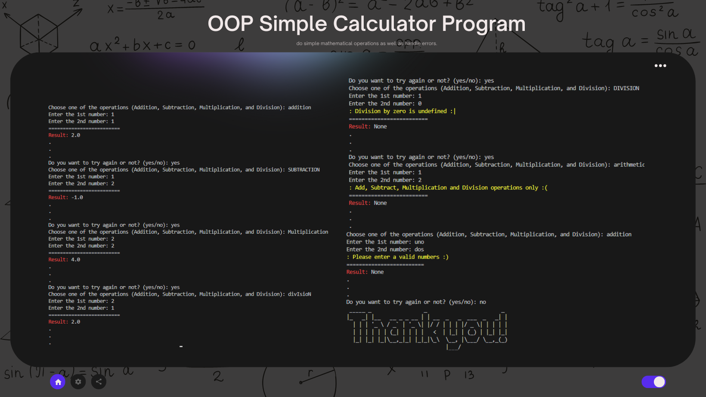

# OOP Simple Calculator
This is a oop version of my simple calculator program. Still, it has functions for doing simple mathematical operations, dealing with errors of any kind, and interacting with the user via a command-line interface.

**See sample demo:**  

## 📄 Documentation 

<h3> 🤔 Usage </h3>

-----

1. Run the program in a Python environment.
2. Choose one of the four math operations: addition, subtraction, multiplication, or division.
3. Enter the first number.
4. Enter the second number.
5. The program will display the result of the operation.
6. You can choose to try again or exit the program.

or

1. Fork this repository 
2. Once the repository has been forked, you can clone the repository to your local machine using the `git clone` command followed by the repository URL.
3. Once the repository is cloned, navigate to the directory of the cloned repository using the `cd` command.
4. Now you can work with the files in the cloned repository.
5. If you want to keep your fork in sync with this repository, you can use the `git fetch` and `git merge` commands to pull in changes and merge them into your local copy.

**Reminders:**
> The program uses appropriate exception handling to capture errors during runtime, such as invalid inputs or division by zero.
> Ensure that the following required dependencies are installed: `pyfiglet`

<h3> 🔰 Additional information </h3>

-----

**The Calculator App consists of the following files:**
 
1. `user_input.py`: Defines the Input class that represents user input.
2. `calculation.py`: Defines the Calculate class that performs calculations based on user input.
3. `retry_function.py`: Defines the TryAgain class that allows users to retry or exit the program.
4. `main.py`: The main script that creates instances of the Calculate and TryAgain classes and controls the flow of the application.
 
For detailed information about the implementation of each class and their methods, please refer to the source code files and their respective docstrings.

<h3> 💡 Purpose </h3>

-----

This object-oriented calculator uses many classes to handle user input, calculations, and retry functions. Its structure leads to modularity and ease of maintenance in the code. By providing an intuitive user interface, error handling, and a reusable code structure, this program's purpose is to enhance the user experience and make basic mathematical calculations more practical.

